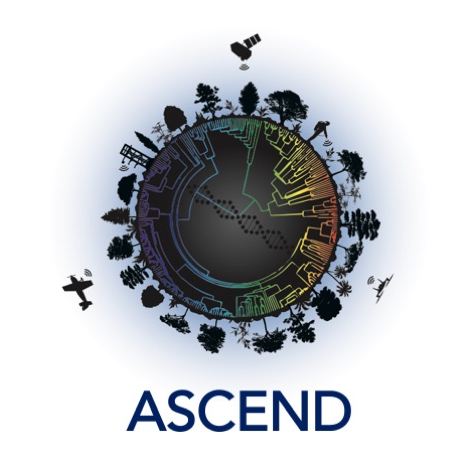

#**A**dvancing **S**pectral biology in **C**hanging **EN**vironments to understand **D**iversity

{ align=right }

One of the [ASCEND’s](https://www.spectralbiology.org/) core values is transparency in scientific research, and to achieve this, we follow the principles of [open science](https://en.wikipedia.org/wiki/Open_science). We created this webpage to serve as a tour guide that provides information on the products generated by the team and our collaborators. In other words, this site provides curated links to get access to the data and codes used to replicate our findings. 

Just click on the navigation tab [Data](https://ascend-bii.github.io/Data-management/Theme/Theme1) and you will find a comprehensive list of our published work and the links to the data and code used. Or click on the links below:

[Theme 1: Intraspecific variation](https://ascend-bii.github.io/Data-management/Theme/Theme1/) 

[Theme 2: Phenotypic variation across the tree of life](https://ascend-bii.github.io/Data-management/Theme/Theme2/)

[Theme 3: Assembly processes and ecosystem functioning](https://ascend-bii.github.io/Data-management/Theme/Theme3/)

[Theme 4: Biogeochemical cycles at ecosystem and landscape scales](https://ascend-bii.github.io/Data-management/Theme/Theme4/)

[Theme 5: Advancing Earth System Models](https://ascend-bii.github.io/Data-management/Theme/Theme5/)

Below you can find a table describing the information provided for our published work.

|           | Definition                  |
|-----------|-----------------------------|
| Year      |Year of publication          | 
| Citation  |Complete bibliographic reference of the product|
| DOI       |Digital Object Identifier    |
| Data      |Direct link to data          |
| Code      |Direct link to code          |
| Theme(s)  |Additional themes associated with product, i.e., if the product is associated with more than one theme, the associated themes are also listed|

*Note: We recommend using Safari, Google Chrome, and Firefox to navigate this webpage.

